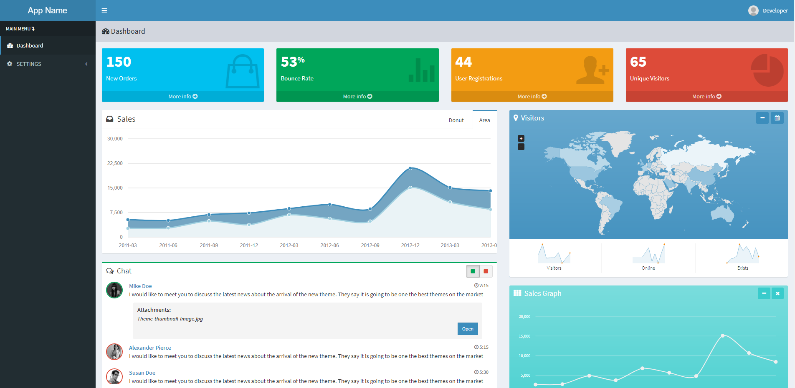

# AdminLTE template Laravel 8 package

Start a new Laravel 8 project with the AdminLTE template installed.



# Installation

1) Create database.
2) Clone repository `git clone https://github.com/rikykukuh/laba-project.git`
3) Copy `.env.example` to `.env`
4) Set valid database credentials of env variables `DB_DATABASE`, `DB_USERNAME`, and `DB_PASSWORD`
5) Run `composer install`
6) Create symbolic link for AdminLTE (Run the commands as an administrator)

- Windows example:
  
 ```php
 mklink /d "C:\xampp\htdocs\laba-project\public\assets\adminlte" "C:\xampp\htdocs\laba-project\vendor\almasaeed2010\adminlte"
 ```
 
 - Linux example:    
    
```php
ln -s public_html/laba-project/vendor/almasaeed2010/adminlte public_html/laba-project/public/assets/adminlte
```
7) Run
```php
php artisan migrate
```
```php
php artisan db:seed
```
```php
php artisan key:generate
```
```php
php artisan serve
```
8) Access the application. Example: `http://127.0.0.1:8000`
9) Login Email:`admin@admin.com` Password: `admin` or Email:`dev@dev.com` Password: `root`
